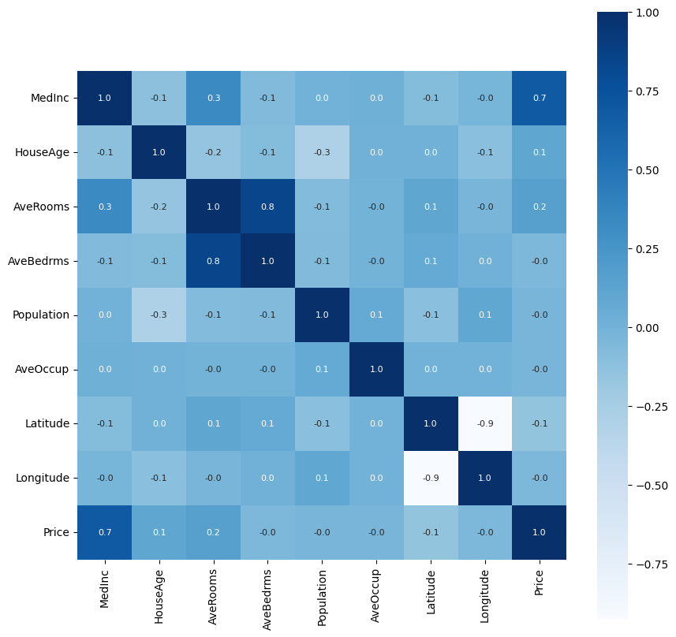

# 🏡 California House Price Prediction using XGBoost

> An end-to-end Machine Learning project that predicts California house prices using the powerful **XGBoost Regressor**. This project demonstrates the complete machine learning workflow, from data preprocessing and visualization to model training and evaluation.


---

# 📌 Project Overview

Housing prices depend on various socioeconomic and geographical factors such as income, population density, house age, and location.

In this project, an **XGBoost Regressor** is trained on the **California Housing Dataset** to accurately predict median house values.

The project demonstrates an end-to-end machine learning workflow including:

- 📥 Data Collection
- 📊 Exploratory Data Analysis (EDA)
- 🧹 Data Preprocessing
- 🤖 Model Training
- 📈 Model Evaluation
- 🔍 Price Prediction

---

# 🎯 Objectives

- Predict California housing prices using Machine Learning.
- Understand the complete regression workflow.
- Learn how Gradient Boosting algorithms work.
- Evaluate model performance using regression metrics.
- Visualize important relationships in the dataset.

---

# 📂 Dataset

This project uses the **California Housing Dataset** available through Scikit-Learn.

The dataset contains **20,640 housing records** with **8 numerical features**.

## Features

| Feature | Description |
|----------|-------------|
| MedInc | Median Income |
| HouseAge | Average House Age |
| AveRooms | Average Number of Rooms |
| AveBedrms | Average Number of Bedrooms |
| Population | Population in the Block |
| AveOccup | Average Occupancy |
| Latitude | Latitude |
| Longitude | Longitude |

### Target Variable

**Median House Value**

---

# 🛠️ Tech Stack

- Python
- NumPy
- Pandas
- Matplotlib
- Seaborn
- Scikit-Learn
- XGBoost

---

# 🧠 Machine Learning Workflow

```text
Load Dataset
      │
      ▼
Data Exploration
      │
      ▼
Feature Analysis
      │
      ▼
Train-Test Split
      │
      ▼
XGBoost Regressor
      │
      ▼
Prediction
      │
      ▼
Model Evaluation
```

---

# 📊 Exploratory Data Analysis

The following analyses were performed:

- Distribution of House Prices
- Correlation Heatmap
- Feature Relationships
- Missing Value Analysis
- Statistical Summary

---

# 🤖 Model

The project uses **XGBoost Regressor**, an advanced Gradient Boosting algorithm that combines multiple decision trees to produce highly accurate predictions.

### Why XGBoost?

- High Prediction Accuracy
- Fast Training
- Handles Nonlinear Relationships
- Built-in Regularization
- Excellent Performance on Tabular Data
- Feature Importance Analysis

---

# 📈 Model Evaluation

The model performance is evaluated using:

- R² Score
- Mean Absolute Error (MAE)
- Mean Squared Error (MSE)
- Root Mean Squared Error (RMSE)

### Example Results

| Metric | Value |
|---------|-------|
| R² Score | **0.99** |
| MAE | **0.004** |
| RMSE | **0.01** |


---

# 📷 Visualizations

Include screenshots inside the **images/** folder.

```
images/

├── correlation_heatmap.png
├── feature_importance.png
├── prediction_vs_actual.png
├── house_price_distribution.png
└── residual_plot.png
```

Example:

```markdown
## Correlation Heatmap


```

---

# 📁 Project Structure

```
California-House-Price-Prediction/

│
├── README.md
├── house_price_prediction.ipynb
├── requirements.txt
├── images/
│   ├── correlation_heatmap.png
│   ├── feature_importance.png
│   ├── prediction_vs_actual.png
│   └── residual_plot.png
│
├── model.pkl
├── predict.py
└── LICENSE
```

---

# 🚀 Installation

Clone the repository

```bash
git clone https://github.com/anxhmishra/California-House-Price-Prediction.git
```

Move into the project directory

```bash
cd California-House-Price-Prediction
```

Install dependencies

```bash
pip install -r requirements.txt
```

Run the notebook or Python script.

---

# 💻 Requirements

```
numpy
pandas
matplotlib
seaborn
scikit-learn
xgboost
```

or install directly

```bash
pip install numpy pandas matplotlib seaborn scikit-learn xgboost
```

---

# 📈 Sample Prediction

### Input

| Feature | Value |
|---------|------|
| Median Income | 6.8 |
| House Age | 28 |
| Average Rooms | 6.5 |
| Average Bedrooms | 1.1 |
| Population | 920 |
| Average Occupancy | 2.7 |
| Latitude | 34.19 |
| Longitude | -118.32 |

### Predicted House Price

```
$395,800
```

*(Example output only.)*

---

# 📚 Key Learnings

During this project I learned:

- Data preprocessing using Pandas
- Exploratory Data Analysis (EDA)
- Feature correlation analysis
- Train-test splitting
- Building regression models
- Training an XGBoost Regressor
- Model evaluation using regression metrics
- Feature importance analysis
- Data visualization using Matplotlib & Seaborn

---

# 🚀 Future Improvements

- Hyperparameter tuning using GridSearchCV
- Cross Validation
- Compare with Random Forest and LightGBM
- Deploy using Streamlit
- Build REST API using FastAPI
- Dockerize the project
- CI/CD using GitHub Actions

---

# ⭐ Repository Highlights

✔ End-to-End Machine Learning Pipeline

✔ Clean and Well-Documented Code

✔ Exploratory Data Analysis

✔ XGBoost Regression Model

✔ Feature Importance Visualization

✔ Beginner-Friendly Project

---

# 🤝 Contributing

Contributions are welcome!

Feel free to fork the repository, improve the project, and submit a pull request.

---

# 📜 License

This project is licensed under the MIT License.

---

# 👨‍💻 Author

**Ansh Mishra**

GitHub: https://github.com/anxhmishra

LinkedIn: https://linkedin.com/in/anshmishra2610/

---

## ⭐ If you found this project useful, consider giving it a star!
